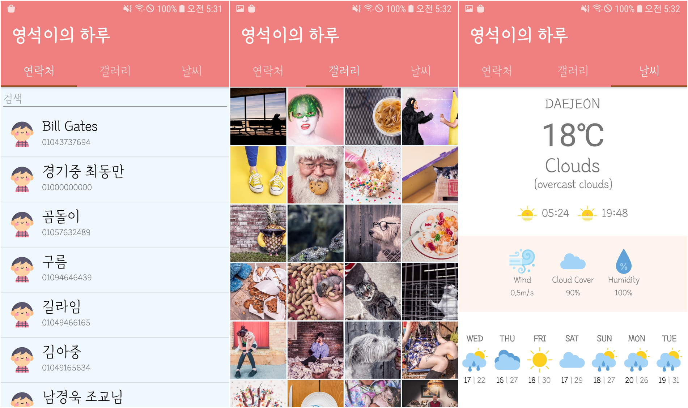

## 정현이의 하루

### 기능
#### 탭 1 - 연락처
기기에 있는 연락처를 가져와서 목록을 구성합니다. 각 아이템을 클릭하면 새로운 창이 나와 이름, 전화번호, 이메일, 메모를 열람할 수 있습니다. 또한, 연락처의 이름과 전화번호를 이용한 검색 기능을 지원합니다. 연락처를 최신 상태로 유지하고 싶다면 스크롤 다운을 하여 정보가 업데이트해보세요!
#### 탭 2 - 갤러리
갤러리에 저장된 이미지를 가져와 격자 모양의 목록을 구성합니다. 각 아이템을 클릭하면 전체화면으로 확대된 이미지가 출력되며, 그 이미지를 두 손가락을 이용해 확대 축소를 해볼 수도 있습니다. 탭 1과 마찬가지로 새로고침 기능을 지원합니다.
#### 탭 3 - 날씨 정보
현재의 위치 정보를 기반으로 그 위치의 날씨 정보를 받아와 온도, 현재 날씨, 일출/일몰 시간, 풍속, 구름의 양, 습도를 보여줍니다. 또한, 향후 7일의 날씨와 최저/최고 기온을 열람할 수 있으며, 가장 하단에는 향후 24시간의 온도가 그래프의 형태로 기록되어 있습니다.

### 초기설정
```xml
<resources>
    <string name="weather_key">{API key}</string>
</resources>
```
위 내용의 `res/values/keys.xml`를 추가하여 [OpenWeatherMap API](https://openweathermap.org/api)에서 발급받은 API 키를 `{API key}`에 넣습니다.

### 권한
다음의 권한들을 앱의 구동을 위하여 반드시 허용하여야 합니다.
- 연락처 읽기 - 탭1의 연락처를 구성할 떄 사용합니다.
- 외부 저장소 읽기 - 탭2의 갤러리의 이미지를 구성할 때 사용합니다
- 위치 정보 - 탭3의 날씨 정보를 로드할 때 사용합니다.

### 제작자
- [김정현](https://github.com/Jeonghyun109)
- [최영석](https://github.com/3-24)
